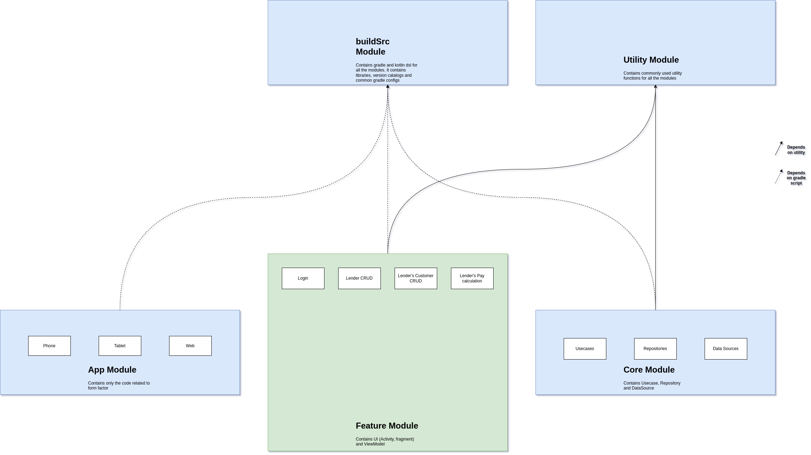

**Finance Ledger Multiplatform Requirements:**

1. Modularize app to support multiplatform. Have domain and data layer as separate module for multip platform development. Feasibility check for KMM. Have app module - sepate folders for phone and tab
2. Login screen - Lender, Borrower. Have separate buttons. Do firebase authentication with gmail or mobile number
3. Lender:
4. Lender account creation. Name of the finance, unique data - name, phone number, email, number of active and inactive customers, number of active and inactive accounts, subscription fee for each account id.
5. Existing customer list, Add button to add customer. Customer search
6. Add filter in navigation for daily, weekly and monthly and all collection
7. A customer having multiple accounts should come under his name and phonenumber or email address with unique account id
8. tapping on customer should show all his accounts. The total amount borrowed, remaining amount. Collection type - daily, monthly, weekly
9. In the customer list. It should show all his accounts with borrowed, remaining and payable amount. Don't have checkbox here
10. Have a button for sum up the collection.
11. It will send the user to a different screen. Where there will be three sections (Tabs) - daily, weekly, monthly
12. The remaining and payable amount should be displayed. Have a check box on all the items and a global select all for all the tabs.
13. The borrow should be able to edit the amount paid
14. Have a floating button or navigation option which will sum up amount and mark data for each customer in db. This will update the amount in the 1st screen
15. Add filters in navigation - new features.
16. Add customer should have name, accound id (serial number - check for validity and show error), phone number, email, collataral information, total amount, amount to be issued, remaining amount to pay, the income and it's percentage, collection type, create user button.
17. Update customer. give customer phonenumber or email. This will show all the accounts with serial number. Edit information
18. Delete customer - soft delete. The serial shall not be reused.
19. Accept or reject finance request.
20. show performance of each customer. Good, average, bad.
21. Borrower:
22. Login - phonenumber or email
23. show his accounts. with all history of data
24. nothing should be editable. he just sees the data.
25. notify him about the amount payment via notification
26. request for new account or new finance
27. contact borrower.
Note:
Serial number should be given by the system. The serial number for lender and borrower

